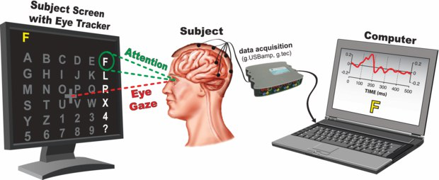
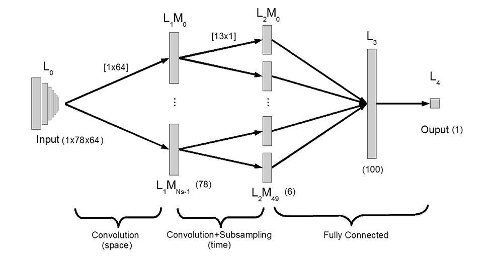
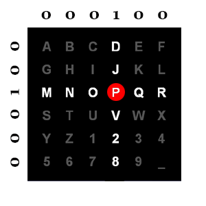

# p300-speller
A BCI speller based on P300 detection using a 1D CNN architecture.

The aim of this project is to understand the limits and the potentials of Brain Computer Interfaces (BCI) used to facilitate communication for people with brain injuries. The methodology implemented in this work is based on the development of binary classification models for Evoked Related Potential (ERP) through which we retrieve the information about the character spelled by the patient.

# Experiment procedure:

The dataset of this project comes from the third BCI competition and consists of 50 min of EEG recordings and speller matrix information from 2 subjects (renamed subject A and subject B). The data is acquired during an experiment set up as follows:

1) The speller matrix is displayed on a monitor in front of the subject. Its columns and rows are numbered sequentially from 1 to 12 (left to right and then top to bottom);

2) For every character epoch the subject is asked to focus his view on a sigle character of the speller matrix for the entirety of the epoch duration;

3) In a single character epoch each one of the 12 columns/rows of the matrix lights up in a random order for 100 ms followed by 75 ms in which every columns/rows is turned off;

4) The procedure is repeated 15 times for each character in the dataset, for a total of 12 x 15 = 180 columns/rows flashes during 15 epochs of a single character;

  

# P300 binary classification:

The first part of this project consists in finding a suitable model for classifying the presence of a P300 response in a given window of 650 ms of the EEG tracks. The class of models considered are 1D Convolutional Neural Networks of 5 layers: 

  

Based on the architecture just proposed, additional models have been developed with some variations:

- **CNN1**: standard model trained over weighted dataset of P300 and no-P300 windows of 64 EEG channels;

- **CNN2a**: identical to CNN1 but only uses 8 EEG electrodes (The eight prefixed channels correspond to the location: FZ, CZ, PZ, P3, P4, PO7, PO8, and OZ in the international 10-20 system of measurement);

- **CNN2b**: identical to CNN2a but the 8 prefixed channels are determined in relation to the weight analysis of the first convolutional layer of CNN1 (i.e. the ideal set of electrodes);

- **CNN2c**: group of models trained using a topological subset of EEG electrodes:
	- F: frontal lobe;
	- C: central lobe;
	- P: parietal lobe;
	- O: occipital lobe;
	- LT: left temporal lobe;
	- RT: right temporal lobe;
	
- **CNN3**: identical to CNN1 but only uses 1 spatial filter in the first convolutional layer, in order to learn the optimal filter;

- **MCNN1**: multiclassifier composed of 5 CNN1s each trained over a different balanced subset;

- **MCNN2**: multiclassifier composed of 5 CNN1s each trained over a different contiguous subset (temporality is preserved);

- **MCNN3**: multiclassifier composed of 3 CNN1s each trained over the whole dataset;

# P300 speller system:

After choosing one of the binary classification model, by giving a batch of 12 windows corrisponding to 12 flashing of a single character epoch we obtain an array of 12 outputs. By processing the output array we get the letter prediction.
1) Sort the 12 outputs in a way that each of the value is indexed following the coloumn/row enumeration adopted;
2) Find the 2 highest value between coloumns (from 1 to 6) and between rows (from 7 to 12) respectively;
3) Round the 2 highest values found to 1 and everything else to 0;
4) Use the indexes corresponding to the 1 to find the column and the row of the speller matrix;
5) Intersect the column and row just found to compute the letter prediction;

For multiple epochs of the same character, before step 1) we first accumulate predictions in a matrix 12 x N_EPOCHS, and then we compute the mean in order to obtain a single array of 12 values. The procedure then follows as described from 1) to 5).

  

# Materials:
All the materials of this project are organized into 3 separate folders:

- **Python_script**: contains all notebook scripts (.ipynb files);

- **Dataset**: contains all training and testing sets for both subjects, EEG channels names and respective coordinates for the topoplot representation (.mat and .csv files);

# Usage information:
- The project has been developed to be used with Google Colab service, thus the file paths mounted refer to a directory in the Google Drive cloud service for a simple use;

- At the top of all scripts, information about the settings are given. Settings may include:
	- Subject's data selection (A or B);
	- Trained model selection (CNN1, CNN2a, CNN2b, CNN2c, CNN3, MCNN1, MCNN2, MCNN3);
	- EEG channels group selection (F, C, P, O, LT, RT);
	
- All settings available can be changed in the first code section of the notebook script;

- By changing settings the path names will be updated automatically;

- Scripts are divided in sub-sections with headers explaining the procedures implemented;
